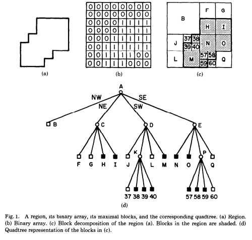
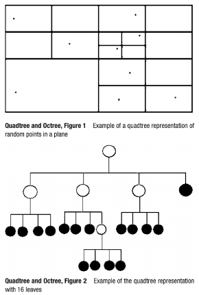
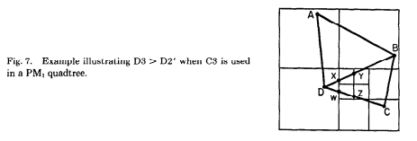
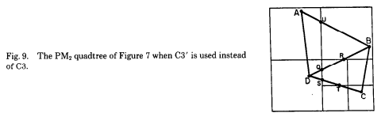
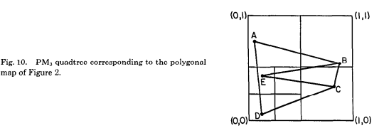
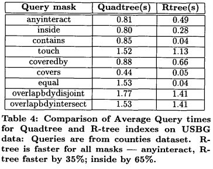
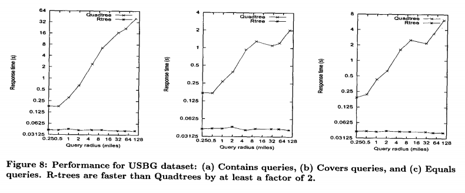
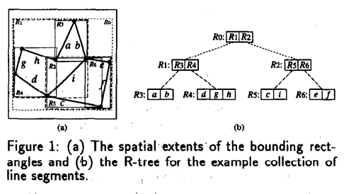
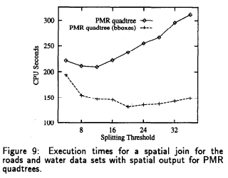

# Informe Final

_Autor: María Lovatón_

## Introducción

Los datos espaciales forman parte del día a día de los seres humanos. Este tipo de datos nos permiten procesar la realidad desde un sistema de referencia espacial y pueden llegar a ser una parte indispensable para diversos sistemas de información. Por ejemplo, los sistemas de información geográfica, cuyas funciones pueden ir desde almacenar códigos postales hasta marcar límites territoriales entre países. La digitalización de esta información permite optimizar recursos y tiempo en las organizaciones.

Una base de datos espaciales se especializa en almacenar, procesar y realizar consultas en objetos definidos en el espacio geométrico. Estos objetos pueden ser puntos, líneas, polígonos, objetos 3D, entre otros. Al no ser datos primitivos, se necesitan de estructuras de datos y algoritmos especializados para su procesamiento. Desde la creación del primer sistema geográfico en los años sesenta, la comunidad científica ha podido desarrollar una gran variedad de herramientas de análisis de datos espaciales.

En este proyecto, analizaremos el quadtree, una estructura de datos espaciales, y usaremos dos de sus variaciones, Point-region y Polygonal-map, para realizar una serie de consultas (spatial join, contains) en datos espaciales. Desde su creación a inicios de los años setenta, esta estructura ha generado diversos estudios y ha sido implementada como parte de algunas bases de datos espaciales.

## Fundamento teórico

### Quadtree

Un quadtree es una estructura de datos espaciales que consiste en un árbol con 4 ramas asociadas que representa un espacio de dos dimensiones (Shekhar, 2007). Estas ramas representan 4 direcciones: norte-oeste, norte-este, sur-oeste y sur-este. Los registros son almacenados en las hojas y los nodos internos sirven para hacer las particiones. Cada nodo posee un rectangulo (bounding box) que define el espacio que representa. A medida que se dividen los nodos, los rectangulos se vuelven más pequeños. La siguiente figura muestra las representaciones que puede tener un quadtree.

En la base de datos, esta estructura se usa para insertar y/o localizar archivos o registros. Se utiliza un algoritmo (depth-first search) para recorrer los nodos usando un heurística que determina si el objetivo se encuentra dentro del espacio del nodo. Al llegar a la hoja, se devuelve si el objetivo se encontraba o no como respuesta. El tiempo de complejidad de búsqueda es O(logh), siendo h la altura del quadtree.

Existen varias variaciones del quadtree: point quadtree, matrix (MX) quadtree, point-region (PR) quadtree, bucket point-region (PR) quadtree, polygonal-map (PM) quadtree, polygonal-map region (PMR) quadtree. Se diferencian ya sea por la configuración de nodos, tipo de objeto (línea, punto) o tipo de registro (conjunto o valor).

### Point-region quadtree

En el point-region quadtree, las celdas contienen un conjunto de puntos. La división se realiza utilizando la cantidad de puntos en una celda. Si este sobrepasa un valor dado, se realiza una división hasta que se encuentre una configuración válida (máximo N puntos por celda). Esto podría causar un "pitfall" en la estructura ya que el tiempo de complejidad de la inserción podría llegar a ser O(n), siendo n la cantidad de puntos en la estructura. Cabe mencionar que los puntos son almacenados en las hojas. La siguiente figura muestra un ejemplo de PR quadtree.

En la base de datos, esta estructura se puede usar para localizar puntos en una determinada región. No es necesario recorrer todo el árbol para conseguir los resultados ya que se pueden cortar las ramas que representan un espacio fuera del objetivo de búsqueda.

### Polygonal-map quadtree

En el polygonal-map quadtree, las celdas contienen un conjunto de segmentos (Samet, 1985). Esta variación de quadtree se puede usar para mapear polígonos, representados por la unión de segmentos. Las hojas contiene máximo un punto (punto extremo de algún segmento). Existen tres tipos de PM quadtree, los cuáles se diferencian por las reglas que se toman al hacer la división. Estos son: PM1 quadtree (más estricto), PM2 quadtree, PM3 quadtree. Existe una variación llamada PMR que usa de manera probabilística las diferentes reglas. Las siguientes figuras muestran los diferentes tipos de PM quadtree.

En la base de datos, esta estructura se puede usar localizar puntos, hacer un overlay de dos PM quadtrees y se pueden aplicar algoritmos de spatial join en las hojas. Esta estructura es eficiente para localizar polígonos ya que las particiones te aseguran un número limitado de posibles polígonos por celda.

## Trabajos relacionados

### QUILT: a geographic information system based on quadtrees

Esta investigación describe una nueva herramienta para el manejo de data espacial usando Quadtrees. QUILT es un GIS que usa variantes de Quadtree para representar regiones, líneas y puntos. Esto se logra implementando un Quadtree lineal, organizado en disco usando un B-tree (Shaffer, 1990).

### Quadtree and R-tree indexes in oracle spatial: a comparison using GIS data

Esta investigación revisa y resume las variantes de Quadtree y R-tree que se han presentado a lo largo de la literatura científica. Asimismo, se compara el rendimiento de las variantes usando grandes datasets en _Oracle Spatial_ y se concluyen en ventajas y desventajas de cada estructura. En sus resultados, los R-trees fueron superiores a los Quadtrees en casi todas las consultas. Sin embargo, en el caso de datasets actualizados en tiempo real, los Quadtrees obtuvieron un mejor rendimiento (Kothuri, 2002). Las siguientes figuras muestran los resultados.

### Benchmarking Spatial Join Operations with Spatial Output

Esta investigación compara el rendimiento del PMR quadtree y el R-tree para realizar un spatial join en un conjunto de datos. En el PMR quadtree, se utiliza un algoritmo de spatial join en las hojas del árbol. En sus resultados, el PMR quadtree muestra un leve superioridad con un tiempo de construcción similar al R-tree. Según el análisis de los resultados, el PMR quadtree maneja de manera más eficiente los bounding boxes (Hoel, 1995). Las siguientes figuras muestran un ejemplo de la estructura a usar y los resultados.

## Resultados

### Implementación

Se implementaron dos estructuras [PM quadtree](https://github.com/mlovatonv/cs3102-proj/blob/main/include/spatial/PMQuadTree.hpp) y [PR quadtree](https://github.com/mlovatonv/cs3102-proj/blob/main/include/spatial/PRQuadTree.hpp). A la vez, varios objetos (línea, rectangulo, punto) y funciones como [utilidades](https://github.com/mlovatonv/cs3102-proj/blob/main/include/spatial/utils.hpp). Ambas estructuras son ejecutadas únicamente en memoria.

#### Utilidades

Estructuras

- `XY`: punto (double x, double y)
- `Line`: línea (XY p1, XY p2)
  - `intersects`
- `PolygonLine`: línea de un polígono (Line l, XY c, int id)
  - `contains`
- `Rectangle`: rectangulo (XY bl, XY tr)
  - `contains`
  - `intersects`
- `Circle`: circulo (XY c, double d)
  - `contains`
  - `intersects`

Funciones

- `eudist`: distance euclidiana entre dos puntos
- `mid`: punto medio entre dos puntos
- `ccw`: verificar si tres puntos poseen dirección counter-clockwise

#### PM quadtree

- `insert`: inserta punto en el árbol
- `locate`: localiza polígono en el cuál se encuentra un punto
- `spatial_join`: localiza polígonos dado un conjunto de puntos

#### PR quadtree

- `insert`: inserta punto en el árbol
- `search`: localiza puntos dado una región

Se crearon unit tests ([PM quadtree](https://github.com/mlovatonv/cs3102-proj/blob/main/test/test_PMQuadTree.cpp), [PR Quadtree](https://github.com/mlovatonv/cs3102-proj/blob/main/test/test_PRQuadTree.cpp)) para comprobar la funcionalidad base de las estructuras.

### Tiempo de ejecución

## Conclusiones

El quadtree es una estructura de datos que puede ser utilizada para responder de manera eficiente consultas como la realización de un spatial join o la búsqueda de registros dentro de un espacio. Sin embargo, pueden haber casos donde su uso sea contraproducente y el uso de otras estructuras, como el R-tree, pueda ser mejor. Se deben tomar en cuenta factores como la distribución de puntos, el orden de inserción, la dinamicidad de los registros, las características del sistema, entre otros.

## Referencias bibliográficas

- Hoel, E. G., & Samet, H. (1995). Benchmarking spatial join operations with spatial output. In VLDB (pp. 606-618).
- Kothuri, R. K. V., Ravada, S., & Abugov, D. (2002, June). Quadtree and R-tree indexes in oracle spatial: a comparison using GIS data. In Proceedings of the 2002 ACM SIGMOD international conference on Management of data (pp. 546-557).
- Samet, H., & Webber, R. E. (1985). Storing a collection of polygons using quadtrees. ACM Transactions on Graphics (TOG), 4(3), 182-222.
- Shaffer, C. A., Samet, H., & Nelson, R. C. (1990). QUILT: a geographic information system based on quadtrees. International Journal of Geographical Information System, 4(2), 103-131.
- Shekhar, S., & Xiong, H. (Eds.). (2007). Encyclopedia of GIS. Springer Science & Business Media.
